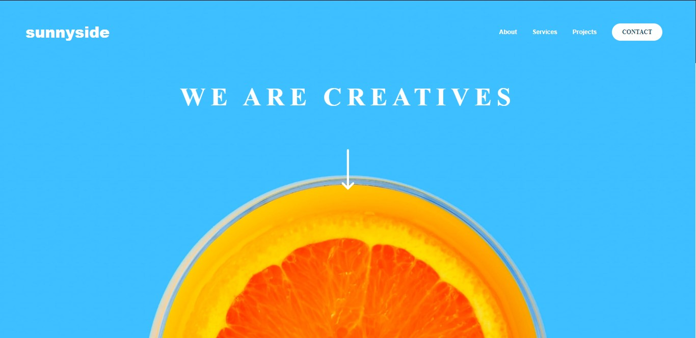

# Frontend Mentor - Sunnyside agency landing page solution

This is a solution to the [Sunnyside agency landing page challenge on Frontend Mentor](https://www.frontendmentor.io/challenges/sunnyside-agency-landing-page-7yVs3B6ef). Frontend Mentor challenges help you improve your coding skills by building realistic projects.

### The challenge

Users should be able to:

- View the optimal layout for the site depending on their device's screen size
- See hover states for all interactive elements on the page

### Screenshot

### Links

- Solution URL: [Frontend mentor](https://www.frontendmentor.io/solutions/responsive-landing-page-using-css-grid-OUqnAE2qb)
- Live Site URL: [Live url](https://lord-psarris.github.io/Sunny-side-landing-page/)

### Built with

- Semantic HTML5 markup
- CSS custom properties
- Flexbox
- CSS Grid

## Author

- Upwork - [Emmanuel Steve](https://www.upwork.com/freelancers/~01780097fc5243ef0b)
- Frontend Mentor - [@Lord-psarris](https://www.frontendmentor.io/profile/Lord-Psarris)
